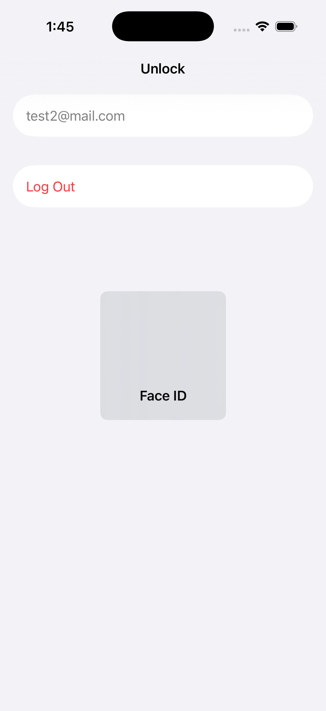
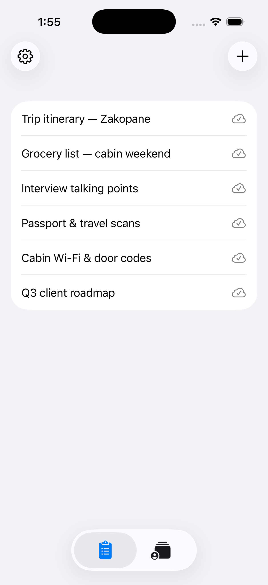
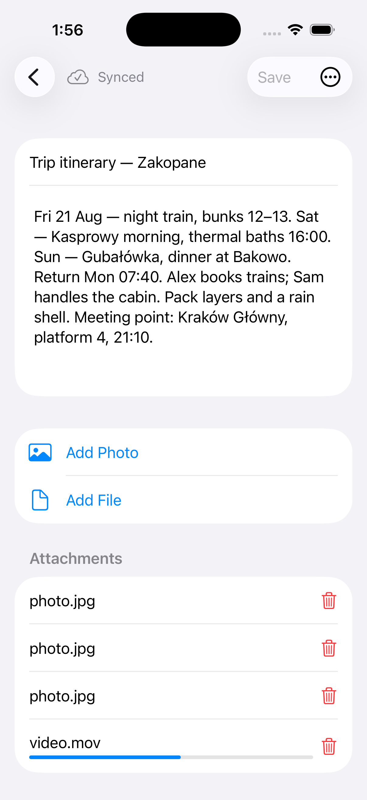
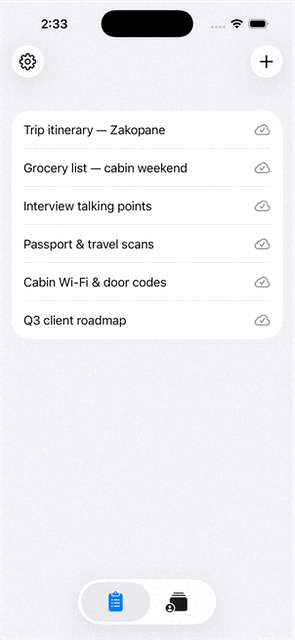
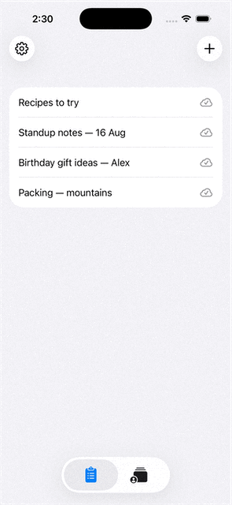

# superSecureNotes

iOS application — an end-to-end encrypted notes vault with sync, biometric unlock, attachments, and cryptographic sharing.

Built to demonstrate production-style mobile engineering: modular Swift packages with protocol/implementation splits, MVVM, composition-root dependency injection, coordinator-style navigation, envelope encryption (CryptoKit), SQLCipher persistence, Keychain session storage, and broad unit test coverage.

**Stack:** Swift 6 · SwiftUI · CryptoKit · SQLCipher · Keychain · LocalAuthentication · async/await

**Backend:** Companion REST API at [super-secure-notes-api](https://github.com/friend4you/super-secure-notes-api) — auth, vault headers, note blobs, attachments, and share grants. The server stores opaque ciphertext; encryption stays on device.

---

## Features

- **Authentication** — Email/password register and login against a REST API, refresh-token restore, session expiry handling
- **Vault** — Password-derived vault on first setup; `vault.meta` uploaded as an opaque blob; User Data Key (UDK) held only in memory while unlocked
- **Biometric unlock** — Optional Face ID / Touch ID enrollment after first setup; password stored in a bio-gated Keychain item; password fallback if biometrics fail or are cancelled
- **Session lock** — Background / device lock wipes in-memory keys and closes the encrypted index; Keychain credentials stay so the next launch is Unlock, not Login
- **Logout** — Full reset: Keychain, local note files, SQLCipher database, and in-memory session; returns to first-launch login
- **Notes** — Create, edit, delete owned notes (title + body); pull-to-refresh; sync status on list rows and detail
- **Attachments** — Photos and files on a note; encrypted separately from the body; preview; per-attachment download progress when hydrating from the server
- **Local-first sync** — Writes and deletes land on device immediately, then push in the background; pending → synced indicators; retry on unlock, refresh, and when the network returns
- **Large uploads** — Attachments over 10 MB use chunked upload with durable session resume after restart
- **Sharing** — Share a synced note by recipient email: wrap the per-note key to their X25519 public key; recipient sees a read-only copy (body, attachments, owner)
- **Shared inbox** — Separate tab for notes shared with the current user; delete the local grant; no edit/save/re-share
- **Offline** — Unlock and browse/edit local notes without the network; first-time register/login requires connectivity

---

## Screenshots

<p align="center">
  
  
  
  
  
</p>

---

## Architecture

The app follows **MVVM** with clean layers: Views → ViewModels → Repositories → Crypto / Persistence / Network.

Feature modules depend on **protocols**. Concrete Keychain, URLSession, SQLCipher, and CryptoKit types are wired once at the composition root (`AppDependencies` + `AppComposition`). Tests mock protocols — they never hit the network or Keychain.

```
┌─────────────────────────────────────────────────────────────┐
│                     SwiftUI screens                         │
│         AuthFlowUI · NotesFlow · ShareNote                  │
└──────────────────────────┬──────────────────────────────────┘
                           │ ViewModels (protocols)
                           ▼
┌──────────────┐  ┌─────────────────┐  ┌─────────────────────┐
│ Auth / vault │  │ LocalNoteRepo   │  │ Share orchestration │
│ repositories │  │ SQLCipher index │  │ recipient key wrap  │
└──────┬───────┘  └────────┬────────┘  └──────────┬──────────┘
       │                   │                      │
       ▼                   ▼                      ▼
┌─────────────────────────────────────────────────────────────┐
│ SecureCrypto · VaultSession (UDK in RAM) · Keychain         │
└──────────────────────────┬──────────────────────────────────┘
                           │ opaque blobs + bearer tokens
                           ▼
                    REST API (/v1)
```

**Navigation** is session-driven. `SessionRootNavigation` picks the root from three states: login (no local setup), unlock (setup exists, vault inactive), notes (vault active). `LockCoordinator` observes background / protected-data events, closes the SQLCipher store, clears `VaultSession`, and returns to Unlock. Routes are registered per module (`AuthRoute`, `NotesRoute`, `ShareNoteRoute`) on a shared navigator.

**Data flow is local-first.** The UI talks to `LocalNoteRepository`. Saves write encrypted body + attachment files and mark `pendingSync`; `LocalFirstNoteSyncService` then uploads in the background (body, then each attachment; chunked when large). Deletes remove local data immediately and enqueue a remote delete. Conflict policy is last-write-wins with etags (`If-Match`) when known. Shared notes hydrate body and attachments on demand, with parallel downloads capped at three.

**Encryption** uses envelope keys so a password change re-wraps only the UDK — note ciphertext is untouched:

```
password + salt  ──PBKDF2 (600k)──▶ KEK ──┐
                                           ├── wrap ──▶ UDK (in VaultSession)
                                           │
                                           ├── wrap ──▶ FEK (one per note)
                                           └── HKDF  ──▶ SQLCipher passphrase
```

Note payloads and attachments are ChaCha20-Poly1305. Sharing wraps the note FEK to the recipient’s identity public key (X25519 + HKDF + ChaChaPoly). The server stores ciphertext and indexed metadata (titles for list UI) — it never holds the UDK or FEKs.

**Dependency injection:** `AppDependencies` constructs stores, network clients, token provider (auto refresh), and the sync service. `AppComposition` builds auth / notes / share factories, lock, and logout, then registers routes. ViewModels receive collaborators through initializers.

### Packages

| Package | Responsibility |
|---------|----------------|
| `SecureCrypto` | KDF, ChaChaPoly, vault.meta / `.note` formats, identity keys, share wrap |
| `VaultSession` | In-memory UDK and identity private key while unlocked |
| `VaultRepository` | Vault header upload/download, recipient public-key lookup |
| `AuthFlow` | Login, register, unlock, biometrics, Keychain `CredentialStore`, auth UI |
| `NoteRepository` | SQLCipher index, local encrypted files, network blobs, local-first sync |
| `NotesFlow` | Note list, create, detail, shared detail, attachments UI |
| `ShareNote` | Share-by-email screen and FEK-wrap orchestration |
| `Navigation` | Navigator, route registry, coordinator |
| `Network` | Reachability (`NWPathMonitor`) |
| App target | Composition root, `LockCoordinator`, scene-phase lock |

Protocol products (`*Protocol`) are what feature modules import. Implementation products are for the app target and tests that need the real type.

### Lock vs logout

| | Lock | Logout |
|---|------|--------|
| In-memory UDK / tokens | Cleared | Cleared |
| SQLCipher index | Closed | Closed and local files wiped |
| Keychain (email, refresh, vault header, bio password) | Kept | Cleared |
| Next screen | Unlock | Login |

---

## Getting started

1. Run the [companion API](https://github.com/friend4you/super-secure-notes-api) at `http://localhost:8000/v1` (the client base URL is `AppDependencies.apiBaseURL`).
2. Open `superSecureNotes.xcodeproj` in Xcode and run on a Simulator or device.

Package tests use `URLProtocol` stubs and isolated Keychain service names — no live backend required:

```bash
swift test --package-path Packages/SecureCrypto
swift test --package-path Packages/AuthFlow
swift test --package-path Packages/NoteRepository
swift test --package-path Packages/VaultSession
swift test --package-path Packages/VaultRepository
swift test --package-path Packages/NotesFlow
swift test --package-path Packages/ShareNote
swift test --package-path Packages/Navigation
```
